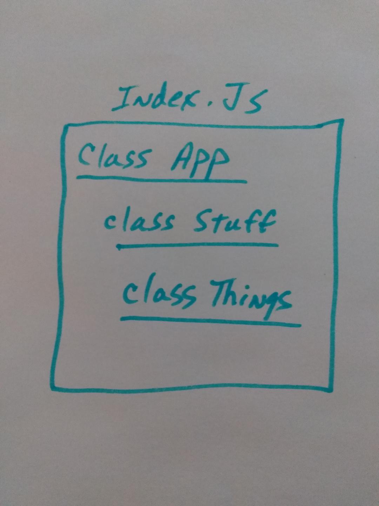
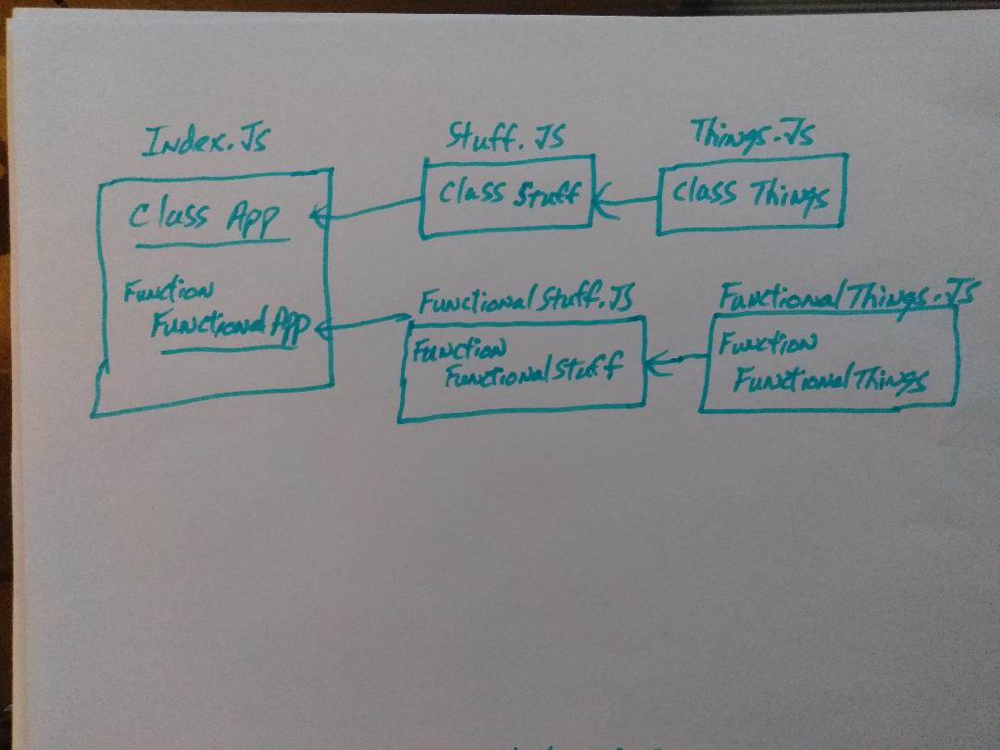

 LAB
=================================================

## Project lab 29

### Author: Ed Puzino

### Links and Resources
* [repo](https://github.com/edpuzino/lab-29-code)
* [travis](https://travis-ci.com/edpuzino/lab-29-code)
* [codeSandBox](https://codesandbox.io/s/135n7zjxyl) Assignment 1
* [codeSandBox](https://codesandbox.io/s/xl0zkv2954) Assignment 2

### Modules
#### `modulename.js`
##### Exported Values and Methods

###### `foo(thing) -> string`
Usage Notes or examples

###### `bar(array) -> array`
Usage Notes or examples

### Setup
#### `.env` requirements
* `PORT` - Port Number
* `MONGODB_URI` - URL to the running mongo instance/db

#### Running the app
* `npm start`
* Endpoint: `/foo/bar/`
  * Returns a JSON object with abc in it.
* Endpoint: `/bing/zing/`
  * Returns a JSON object with xyz in it.

#### Tests
* How do you run tests?
* What assertions were made?
* What assertions need to be / should be made?

#### UML
 Assignment 1
 Assignment 2
